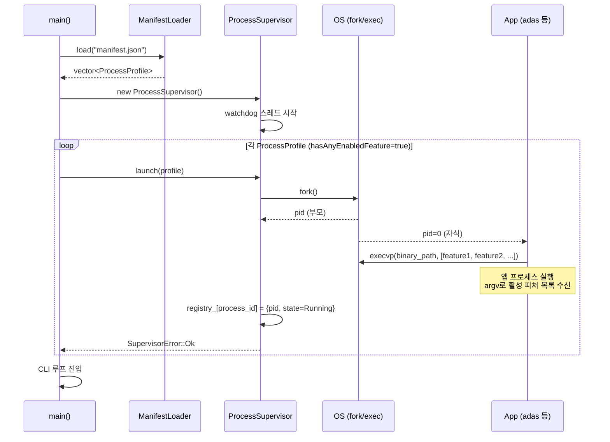
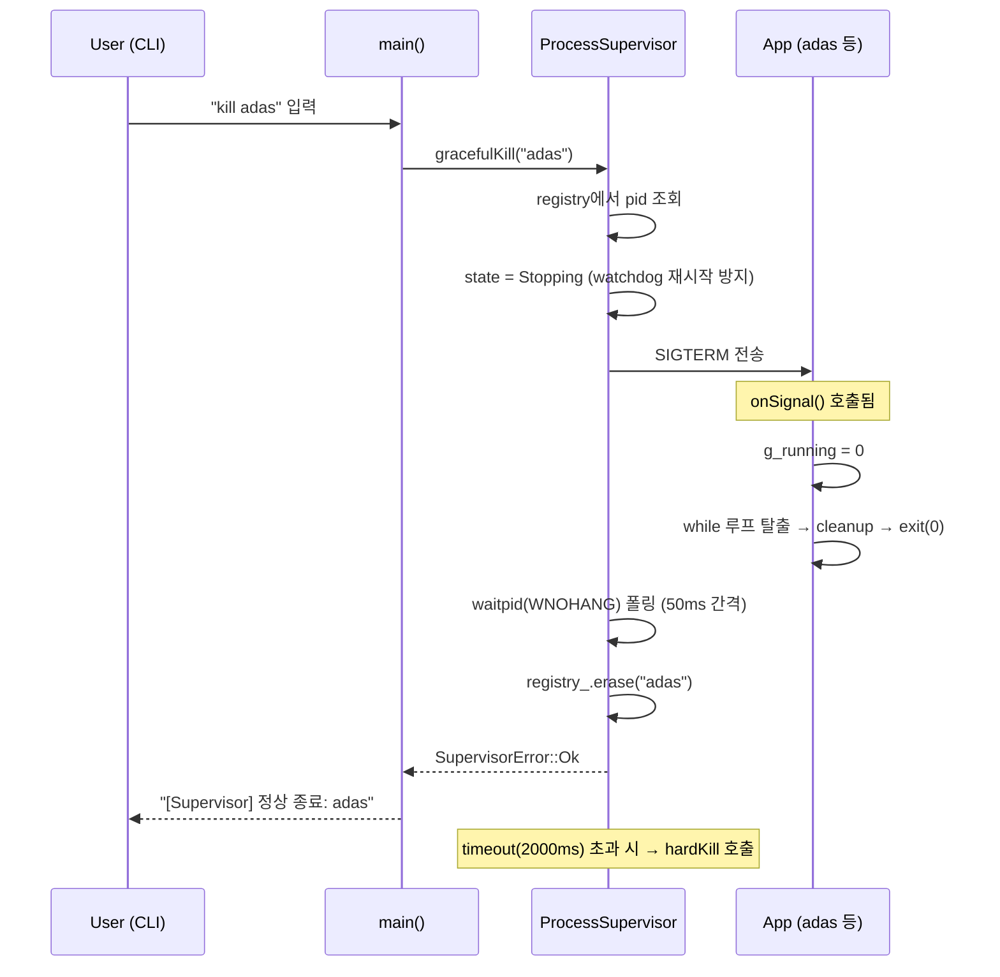
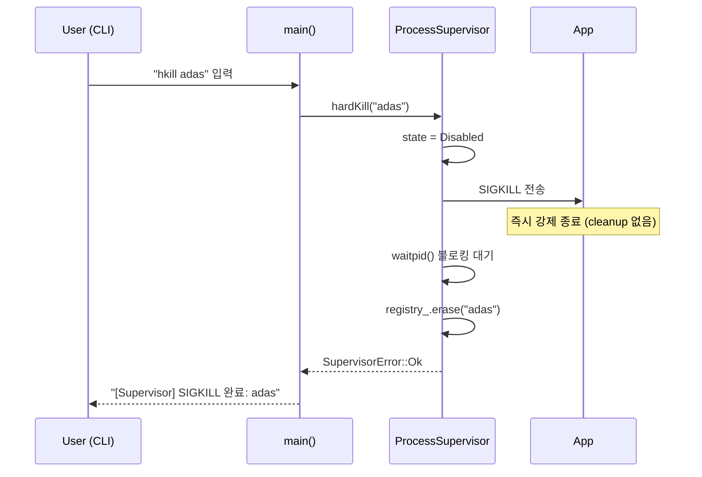
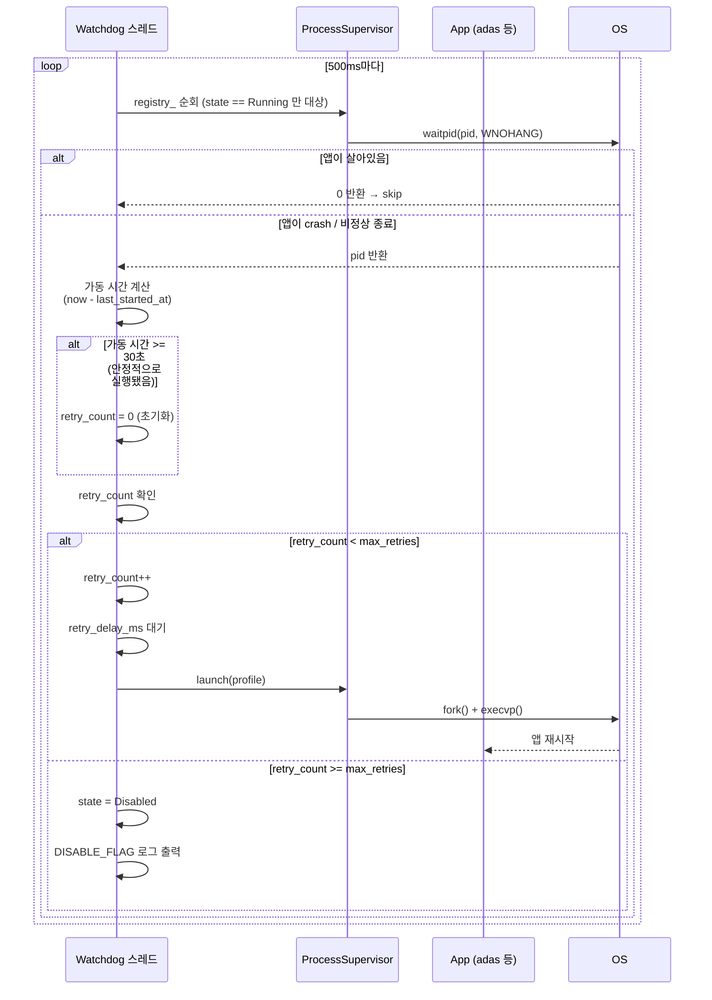
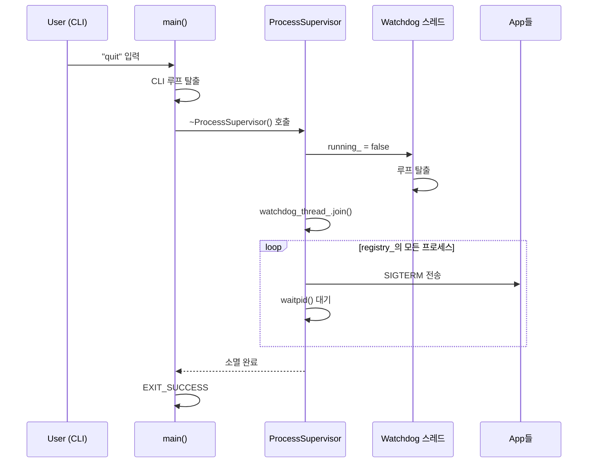
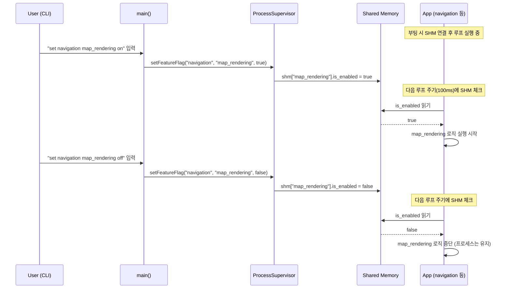

# Architecture

## 전체 컴포넌트 구조 (현재)

```
┌─────────────────────────────────────────────────────────────┐
│                      Platform (main)                        │
│                                                             │
│  manifest.json ──► ManifestLoader ──► ProcessProfile        │
│                                            │                │
│                                     ProcessSupervisor       │
│                                     ├── registry_           │
│                                     │   (ProcessState 기반) │
│                                     └── watchdog 스레드     │◄── 500ms 주기
└─────────────────────────────────────────────────────────────┘
         │ fork/execvp + argv(활성 피처 목록)
         ├──────────────────────┐
         ▼                      ▼
  [adas 프로세스]        [navigation 프로세스]
  argv: collision_avoidance   argv: route_guidance
        blind_spot_detection
  SIGTERM 핸들러              SIGTERM 핸들러
```

---

## 전체 컴포넌트 구조 (Phase 2 - SHM 연동 후)

```
┌─────────────────────────────────────────────────────────────┐
│                      Platform (main)                        │
│                                                             │
│  manifest.json ──► ManifestLoader ──► ProcessProfile        │
│                                            │                │
│                                     ProcessSupervisor       │
│                                     ├── registry_           │
│                                     ├── ShmManager          │◄── SHM 생성/관리
│                                     └── watchdog 스레드     │
└─────────────────────────────────────────────────────────────┘
         │ fork/execvp                  │ SHM write (setFeatureFlag)
         ├─────────────────┐            │
         ▼                 ▼            ▼
  [adas 프로세스]   [navigation 프로세스]
  SHM 읽기          SHM 읽기
  ├ collision_avoidance: is_enabled, is_killed
  └ blind_spot_detection: is_enabled, is_killed

  ※ 프로세스를 죽이지 않고 피처 단위 ON/OFF 가능
```

---

## 핵심 구조체

### ProcessProfile (FeatureProfile.h)
```
ProcessProfile
├── process_id       : 프로세스 식별자 (ex. "navigation")
├── binary_path      : 실행 바이너리 경로
├── restart_policy   : max_retries, retry_delay_ms, action_on_failure
└── features[]       : FeatureFlag 배열
        └── FeatureFlag
            ├── feature_id : 피처 식별자 (ex. "route_guidance")
            └── flag       : 활성 여부 (부팅 시 기준)
```

### ProcessState (ProcessSupervisor.h)
```
Running   → 정상 실행 중, watchdog 재시작 대상
Stopping  → gracefulKill 요청 후 SIGTERM 대기 중 (watchdog 재시작 안 함)
Disabled  → max_retries 초과 또는 kill 완료 (재시작 안 함)
```

---

## 1. 부트 시퀀스

```
main()
  │
  ├─ ManifestLoader::load("manifest.json")
  │     ├─ JSON 파싱
  │     ├─ 각 항목 → ProcessProfile 변환
  │     │     ├─ process_id, binary_path, restart_policy
  │     │     └─ features[] 파싱 (feature_id + flag)
  │     └─ optional<vector<ProcessProfile>> 반환
  │
  ├─ [로드 실패 시] → EXIT_FAILURE
  │
  ├─ ProcessSupervisor 생성
  │     └─ watchdog 스레드 시작 (백그라운드, 500ms 주기)
  │
  ├─ 각 ProcessProfile 순회
  │     ├─ hasAnyEnabledFeature() == true  → supervisor.launch(profile)
  │     │     └─ 활성 피처 ID를 argv로 전달: ./binary feature1 feature2 ...
  │     └─ hasAnyEnabledFeature() == false → skip 로그 출력
  │
  └─ CLI 루프 진입 (stdin 대기)
```

---

## 2. 시퀀스 다이어그램

### 2-1. 부트 / 프로세스 실행 (launch)



---

### 2-2. gracefulKill (정상 종료)

> 핵심: SIGTERM 발송 후 state = **Stopping**으로 전환 → watchdog 재시작 차단.
> 앱이 SIGTERM 핸들러에서 cleanup 후 스스로 exit. timeout 초과 시 SIGKILL.



---

### 2-3. hardKill (강제 종료)



---

### 2-4. Watchdog - 자동 재시작 (+ retry_count 초기화)

> **retry_count 초기화 규칙**: 프로세스가 30초 이상 안정적으로 실행된 뒤 crash하면
> "일시적 오류"로 보고 retry_count를 0으로 초기화. 영구 Disabled 방지.



---

### 2-5. 종료 시 소멸자 처리



---

### 2-6. [Phase 2] SHM 기반 피처 단위 런타임 제어

> 프로세스를 재시작하지 않고 개별 피처를 ON/OFF.
> Supervisor가 SHM에 쓰고, 앱이 자신의 루프에서 읽는다.



---

## 3. 프로세스 상태 전이

```
         launch()
  [없음] ─────────► [Running]
                        │
            gracefulKill()│           앱 crash 감지 (watchdog)
                          │           ┌─────────────────────────┐
                    ┌─────▼─────┐     │  가동 >= 30s → retry_count = 0
                    │ Stopping  │     │  retry_count < max_retries
                    │ (SIGTERM) │     │       → retry_count++
                    └─────┬─────┘     │       → retry_delay_ms 후 launch()
                          │           │       → [Running]
                   waitpid()          │
                   성공 or            │  retry_count >= max_retries
                   timeout→SIGKILL    │       → state = Disabled
                          │           └─────────────────────────┘
                          ▼
                     [Disabled]
                (재시작 없음, registry 유지)
```

---

## 4. SHM 레이아웃 (Phase 2)

```
/dev/shm/platform_<feature_id>  (POSIX SHM, 피처별 1개)

struct FeatureControlState {
    atomic<bool>     is_enabled;   // 피처 활성 여부 (Feature Flag)
    atomic<bool>     is_killed;    // 비상 정지 (Kill Switch)
    atomic<uint64_t> heartbeat;    // 앱이 주기적으로 증가시킴 (생존 확인)
};

우선순위: is_killed > is_enabled
is_killed == true  → 즉시 해당 피처 중단 (is_enabled 무시)
is_enabled == false → 해당 피처 로직 실행 안 함
```
