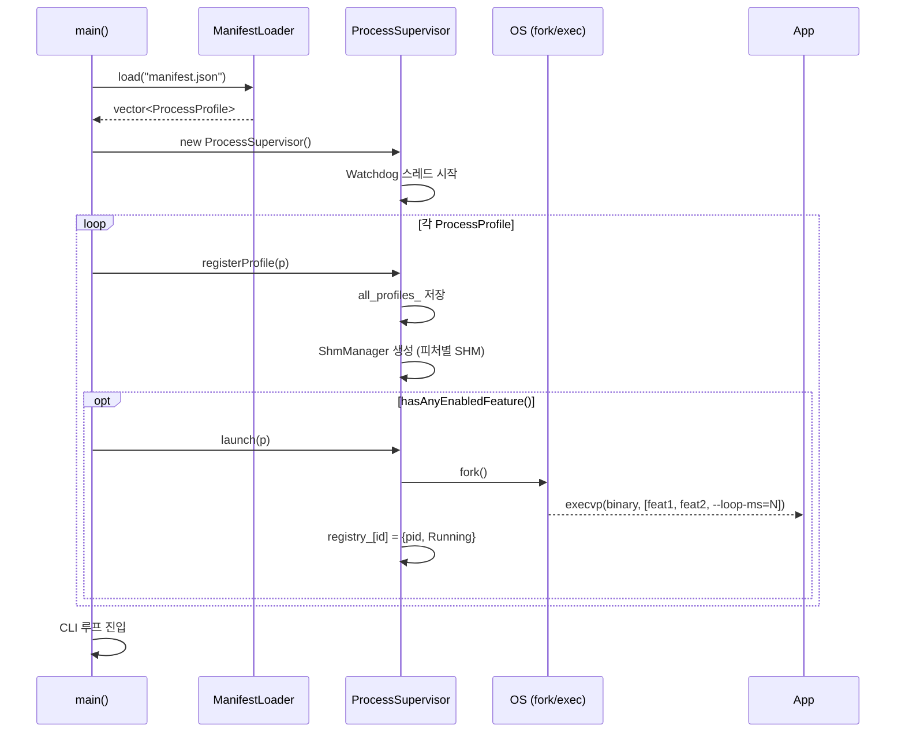
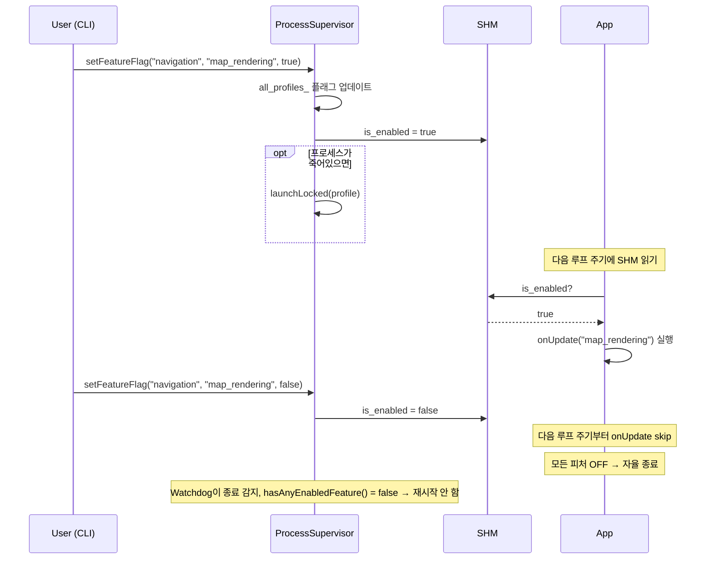
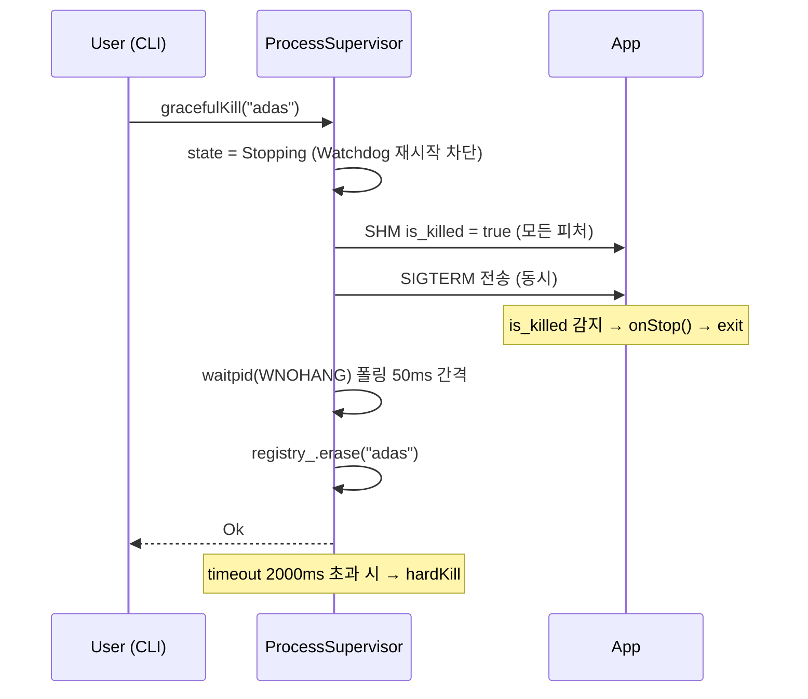
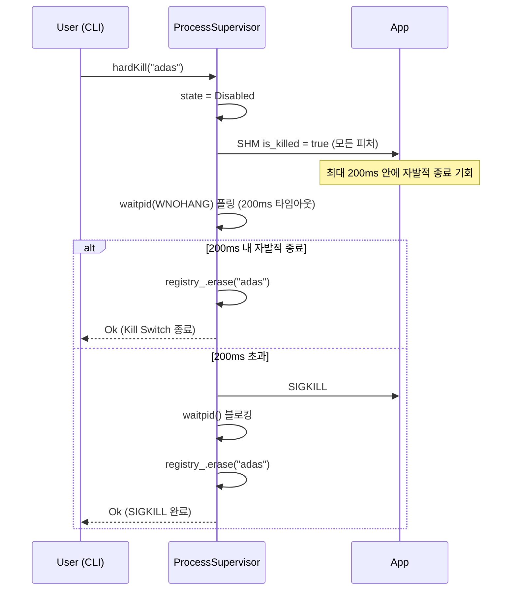
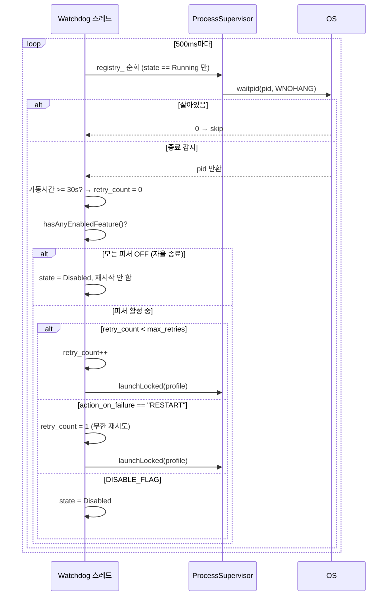

# 아키텍처

---

## 디렉토리 구조

```
Platform/
├── src/
│   ├── supervisor/          ← Platform 프로세스 전용
│   │   ├── main.cpp             진입점, CLI 루프
│   │   ├── ManifestLoader.h/cpp manifest.json 파싱
│   │   ├── FeatureProfile.h     ProcessProfile, FeatureFlag, RestartPolicy 타입
│   │   ├── ProcessRecord.h      런타임 프로세스 상태 (pid, retry_count, state)
│   │   ├── ProcessSupervisor.h/cpp   launch / registerProfile / isAlive / listAll
│   │   ├── ProcessSupervisorKill.cpp gracefulKill / hardKill
│   │   ├── ProcessSupervisorFeature.cpp setFeatureFlag
│   │   └── Watchdog.h/cpp       크래시 감지 및 자동 재시작 스레드
│   └── sdk/                 ← sdv_sdk 정적 라이브러리 (앱이 링크)
│       ├── ShmManager.h/cpp     POSIX SHM 생성·연결 (supervisor·SDK 공유)
│       └── SdvAppFrame.h/cpp    앱 베이스 클래스 (onStart / onUpdate / onStop)
├── application/             ← 앱 바이너리 소스
│   ├── adas.cpp
│   ├── navigation.cpp
│   └── bin/                 빌드 결과물 출력 디렉토리
├── docs/                    문서
├── manifest.json            프로세스·피처 선언
└── CMakeLists.txt
```

---

## 컴포넌트 구조

```
┌──────────────────────────────────────────────────────────────────┐
│                        Platform (Supervisor)                     │
│                                                                  │
│  manifest.json ─► ManifestLoader ─► ProcessProfile              │
│                                           │                      │
│                                    ProcessSupervisor             │
│                                    ├── all_profiles_  (등록 전체) │
│                                    ├── registry_      (런타임 상태)│
│                                    ├── shm_slots_     (SHM 소유)  │
│                                    └── Watchdog       500ms 주기  │
└──────────────────────────────────────────────────────────────────┘
         │ fork/execvp                  │ SHM write (setFeatureFlag/kill)
         │ argv: feature_ids +          │
         │       --loop-ms=N            │
         ▼                              ▼
  [adas 프로세스]              /dev/shm/platform_<feature_id>
  sdv_sdk 링크                 FeatureControlState {
  SdvAppFrame::run()             atomic<bool> is_enabled
  ├── ShmManager::connect()      atomic<bool> is_killed
  └── 루프: SHM 읽기            atomic<uint64_t> heartbeat
                               }
```

---

## 핵심 타입

### ProcessProfile (`FeatureProfile.h`)

```
ProcessProfile
├── process_id       : "adas", "navigation" 등
├── binary_path      : 실행 바이너리 경로
├── loop_interval_ms : SDK 메인 루프 주기 (manifest → argv로 주입)
├── restart_policy
│   ├── max_retries       : 최대 자동 재시작 횟수
│   ├── retry_delay_ms    : 재시작 전 대기 시간
│   └── action_on_failure : "DISABLE_FLAG" | "RESTART"
└── features[]
        └── FeatureFlag
            ├── feature_id : "collision_avoidance" 등
            └── flag       : 부팅 시 초기 활성 여부
```

### ProcessState (`ProcessRecord.h`)

| 상태 | 의미 | Watchdog 재시작 |
|------|------|----------------|
| `Running` | 정상 실행 중 | 대상 |
| `Stopping` | gracefulKill 요청, SIGTERM 대기 중 | 차단 |
| `Disabled` | kill 완료 또는 max_retries 초과 | 차단 |

### FeatureControlState (`ShmManager.h`)

```
/dev/shm/platform_<feature_id>  (피처 1개당 SHM 1개)

is_killed  > is_enabled  (우선순위)
is_killed  = true  → onStop() 즉시 호출 후 종료
is_enabled = false → 해당 피처 onUpdate() 실행 안 함 (프로세스는 유지)
heartbeat         → onUpdate() 마다 +1 (생존 확인용)
```

---

## 부트 시퀀스

```
main()
  │
  ├─ ManifestLoader::load("manifest.json")
  │     └─ ProcessProfile 배열 반환 (실패 시 EXIT_FAILURE)
  │
  ├─ ProcessSupervisor 생성
  │     └─ Watchdog 스레드 시작 (500ms 주기)
  │
  ├─ 각 ProcessProfile 순회
  │     ├─ registerProfile(p)        ← 항상 등록 (SHM 생성 포함)
  │     └─ hasAnyEnabledFeature()?
  │           true  → launch(p)      ← fork/execvp
  │           false → 대기 로그 출력  (set 명령으로 나중에 기동 가능)
  │
  └─ CLI 루프 (stdin 대기)
```

---

## 시퀀스 다이어그램

### 부트 / launch



---

### setFeatureFlag (런타임 ON/OFF)



---

### gracefulKill



---

### hardKill



---

### Watchdog 자동 재시작



---

### 프로세스 상태 전이

```
         registerProfile() + launch()
  [없음] ────────────────────────────► [Running]
                                           │
                              gracefulKill()│        Watchdog 크래시 감지
                                           │     ┌──────────────────────────┐
                                     [Stopping]  │  retry < max → 재시작    │
                                           │     │  retry >= max            │
                                    waitpid()    │    DISABLE_FLAG → Disabled│
                                    or SIGKILL   │    RESTART → 무한 재시도  │
                                           │     └──────────────────────────┘
                                           ▼
                                      [Disabled]
                              (registry 유지, 재시작 없음)
```

---

## SHM 수명 관리

SHM은 **프로세스 수명이 아닌 피처 등록 수명**을 따릅니다.

```
registerProfile()  → ShmManager 생성 (SHM /dev/shm/platform_<id> 생성)
launch()           → 프로세스 기동, SHM is_killed 초기화
프로세스 종료      → SHM 유지 (Supervisor가 계속 소유)
프로세스 재기동    → 기존 SHM 재사용 (is_killed = false 초기화)
~ProcessSupervisor → ShmManager 소멸 → shm_unlink
```

이렇게 설계한 이유:
- **BUG-1 방지**: 이전 설계에서는 launchLocked()가 SHM을 재생성할 때 기존 ShmManager가 소멸되며 shm_unlink가 발생 → 자식 프로세스가 shm_open 실패 → SHM 없이 실행 → 자율 종료 조건 미충족 → 프로세스가 영원히 생존하는 버그
- **단순성**: Supervisor가 SHM의 단일 소유자, 앱은 connect()로 읽기·쓰기만
