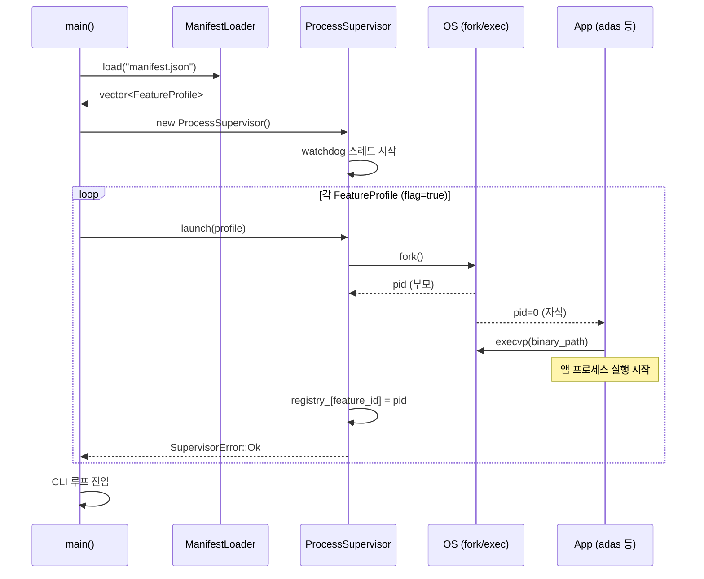
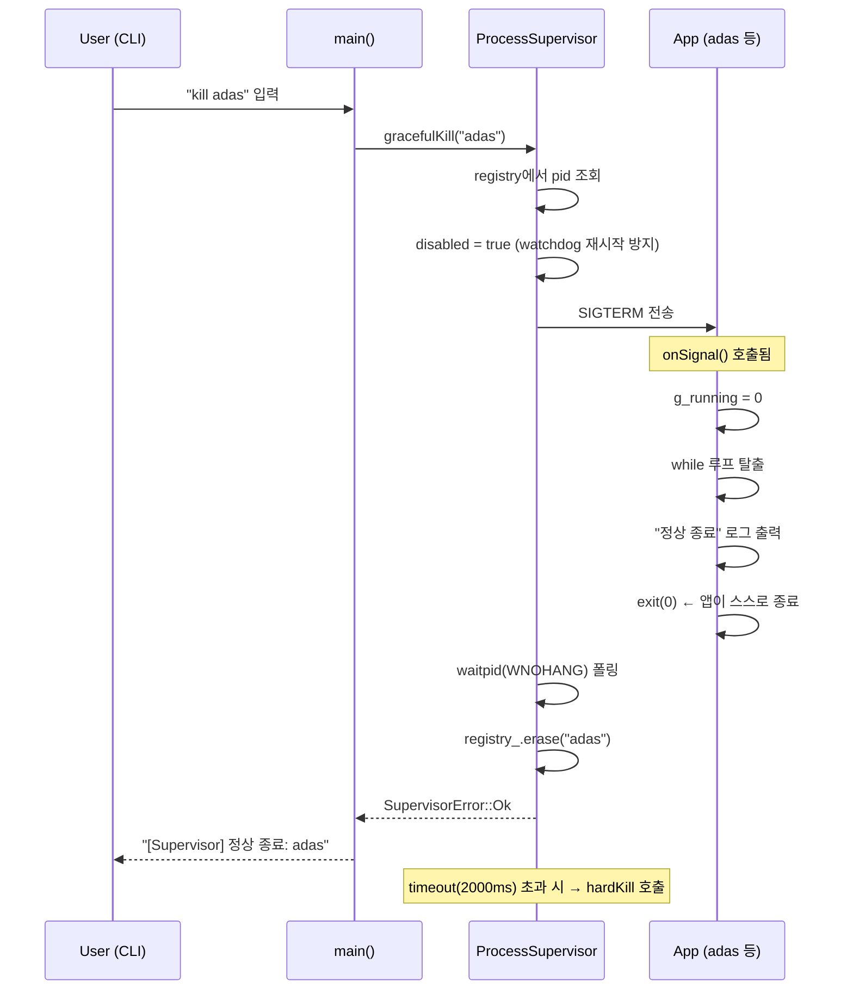
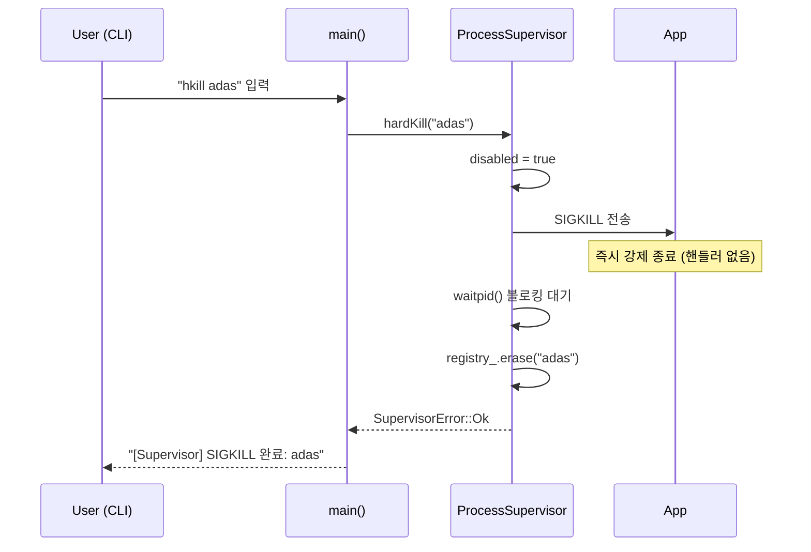
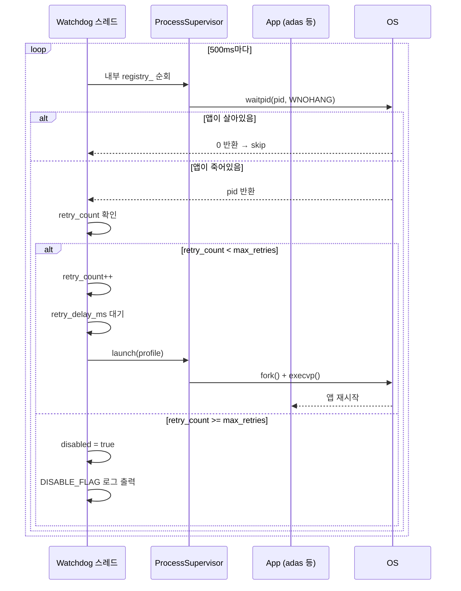
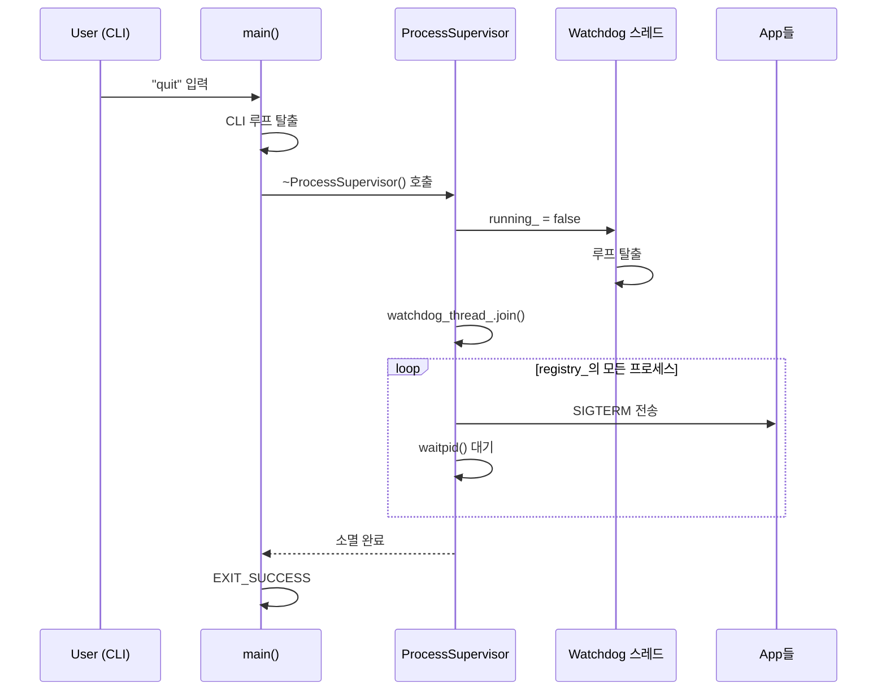

# Architecture - 부트 순서 및 시퀀스 다이어그램

## 전체 컴포넌트 구조

```
┌─────────────────────────────────────────────────────┐
│                    Platform (main)                  │
│                                                     │
│  manifest.json ──► ManifestLoader ──► FeatureProfile│
│                                           │         │
│                                    ProcessSupervisor│
│                                    ├── registry_    │
│                                    └── watchdog     │◄─── 백그라운드 스레드
└─────────────────────────────────────────────────────┘
         │ fork/execvp                │ fork/execvp
         ▼                           ▼
    [adas 프로세스]           [navigation 프로세스]
    SIGTERM 핸들러             SIGTERM 핸들러
```

---

## 1. 부트 시퀀스

```
main()
  │
  ├─ ManifestLoader::load("manifest.json")
  │     ├─ JSON 파일 열기 / 파싱
  │     ├─ 각 항목 → FeatureProfile 변환
  │     │     └─ 파싱 실패 항목은 skip (fail-safe)
  │     └─ optional<vector<FeatureProfile>> 반환
  │
  ├─ [로드 실패 시] → EXIT_FAILURE
  │
  ├─ ProcessSupervisor 생성
  │     └─ watchdog 스레드 시작 (백그라운드, 500ms 주기)
  │
  ├─ 각 FeatureProfile 순회
  │     ├─ flag == true  → supervisor.launch(profile)
  │     └─ flag == false → skip 로그 출력
  │
  └─ CLI 루프 진입 (stdin 대기)
```

---

## 2. 시퀀스 다이어그램

### 2-1. 부트 / 프로세스 실행 (launch)



---

### 2-2. gracefulKill (정상 종료)

> 핵심: supervisor가 SIGTERM을 보내고, **앱이 스스로 핸들러에서 정리 후 exit**.
> supervisor는 기다리고, timeout 초과 시에만 SIGKILL.



---

### 2-3. hardKill (강제 종료)



---

### 2-4. Watchdog - 자동 재시작



---

### 2-5. 종료 시 소멸자 처리



---

## 3. 상태 전이 (프로세스 단위)

```
         launch()
  [없음] ─────────► [실행 중 (alive)]
                         │
              SIGTERM     │     앱 자체 crash
          gracefulKill()  │  (watchdog 감지)
                    ┌─────┴─────┐
                    ▼           ▼
              [종료 대기]    [재시작 대기]
                    │     retry < max  │
              waitpid()               │ retry_delay_ms 후
                    │                 ▼
              [registry      [실행 중 (alive)]  ← retry_count++
               에서 제거]
                               retry >= max
                                    │
                                    ▼
                             [disabled (DISABLE_FLAG)]
```
